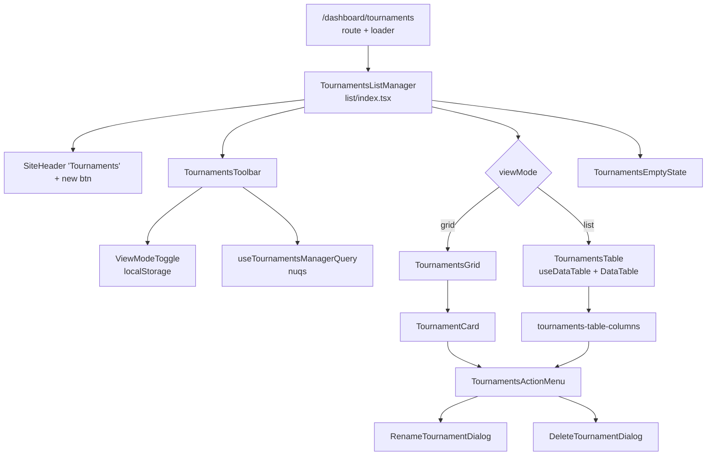

# Admin CRM Redesign + Pending Features

## Context

- PRD: [PRD.md](PRD.md)
- Domain language: [CONTEXT.md](CONTEXT.md)
- Feature tracker: [docs/project-todo.md](docs/project-todo.md)
- Technical direction: [docs/todo-technical-changes.md](docs/todo-technical-changes.md)
- Prior-art plan style: [docs/plans/athletes-feature-completion.md](docs/plans/athletes-feature-completion.md)
- Prior-art table state PRD: [docs/prd/athlete-data-table-state-prd.md](docs/prd/athlete-data-table-state-prd.md)

## Scope decisions (locked in chat)

- UI redesign: **list page only** (`/dashboard/tournaments`). Detail viewer and builder stay untouched in this plan.
- Feature plan covers: **5 Admin CRM bullets + Group Control Lease + Advance Settings selection-view**. Arena Client UI work is a future plan.
- Status field: add `Tournament.status` migration upfront — both the redesign and the lifecycle feature need it.
- Card kebab: Open, Rename, Delete.

## Visual direction

Refined Supabase-style minimalism. Strip current `CanvasReveal` + `DecorIcon` + radial-gradient + `motion` hover effects from `tournament-card.tsx`. Color reserved for status pills only. Hover = subtle border accent + bg tint.

---

## Phase A — Tournament list redesign

### Folder structure (mirrors `src/features/dashboard/athlete/`)

The new list page lives under a dedicated `list/` subtree that mirrors the athlete feature shape one-to-one. Each athlete file has a tournament twin:

```
src/features/dashboard/tournament/list/
├── index.tsx                                       ← page composition (mirrors athlete/index.tsx)
├── hooks/
│   └── use-tournaments-manager-query.ts            ← URL state via nuqs (mirrors use-athlete-manager-query.ts)
└── components/
    ├── tournaments-toolbar/
    │   ├── index.tsx                               ← page-level toolbar (search · status · view toggle · +new)
    │   └── view-mode-toggle.tsx                    ← grid|list toggle (localStorage-backed)
    ├── tournaments-grid/
    │   ├── index.tsx                               ← grid container (responsive grid)
    │   ├── tournament-card.tsx                     ← REWRITTEN card (Supabase-style)
    │   └── tournament-card-skeleton.tsx
    ├── tournaments-table/                          ← MIRRORS athlete/components/athlete-table/
    │   ├── index.tsx                               ← TournamentsTable shell (uses useDataTable + DataTable)
    │   ├── tournaments-table-columns.tsx           ← column defs (mirrors athletes-table-columns.tsx)
    │   └── tournaments-action-menu.tsx             ← per-row kebab (mirrors athletes-action-menu.tsx)
    ├── tournament-status-pill.tsx                  ← shared between grid + list
    ├── tournaments-empty-state.tsx                 ← inline empty (replaces tournament-empty.tsx)
    └── dialogs/                                    ← mirrors athlete/components/dialogs/
        ├── rename-tournament-dialog.tsx
        └── delete-tournament-dialog.tsx
```

Files **deleted** at the end of Phase A:

- [src/features/dashboard/tournament/tournament-list.tsx](src/features/dashboard/tournament/tournament-list.tsx) (replaced by `list/index.tsx`)
- [src/features/dashboard/tournament/tournament-card.tsx](src/features/dashboard/tournament/tournament-card.tsx) (replaced by `list/components/tournaments-grid/tournament-card.tsx`)
- [src/features/dashboard/tournament/tournament-empty.tsx](src/features/dashboard/tournament/tournament-empty.tsx) (folded into `tournaments-empty-state.tsx`)

The barrel in [src/features/dashboard/index.tsx](src/features/dashboard/index.tsx) is updated so `TournamentListPage` resolves to the new `list/index.tsx`. The route file [src/routes/dashboard/tournaments/index.tsx](src/routes/dashboard/tournaments/index.tsx) is unchanged.

---

### A0. Add `Tournament.status` foundation

- Edit [prisma/schema.prisma](prisma/schema.prisma): add `enum TournamentStatus { draft active completed }` and `status TournamentStatus @default(draft)` on `model Tournament`.
- Regenerate Prisma client (`prisma generate`).
- Update [src/orpc/tournaments/tournaments.dal.ts](src/orpc/tournaments/tournaments.dal.ts) to select/return `status` on `list` and `get`.
- Update oRPC output schema in `src/orpc/tournaments/*.ts` so `status` is part of `TournamentListItem`.
- Update the `TournamentListItem` type in [src/features/dashboard/types.ts](src/features/dashboard/types.ts) (or wherever it lives) to include `status: 'draft' | 'active' | 'completed'`.
- No transition logic yet — that's Phase C. Default is always `draft`.

### A1. URL-state hook — `use-tournaments-manager-query.ts`

Mirror [src/features/dashboard/athlete/hooks/use-athlete-manager-query.ts](src/features/dashboard/athlete/hooks/use-athlete-manager-query.ts) one-to-one. Each `useQueryState` call becomes a parallel field for the tournaments list.

```ts
// src/features/dashboard/tournament/list/hooks/use-tournaments-manager-query.ts
import {
  parseAsArrayOf,
  parseAsInteger,
  parseAsString,
  parseAsStringEnum,
  useQueryState,
} from 'nuqs';
import type { TournamentListItem } from '@/features/dashboard/types';
import {
  getFiltersStateParser,
  getSortingStateParser,
} from '@/lib/data-table/parsers';

const SORTABLE_COLUMN_IDS = new Set([
  'name',
  'status',
  'createdAt',
  'athletes',
]);

export function useTournamentsManagerQuery() {
  const [page] = useQueryState('page', parseAsInteger.withDefault(1));
  const [perPage] = useQueryState('perPage', parseAsInteger.withDefault(20));
  const [queryFilter] = useQueryState('query');
  const [nameFilter] = useQueryState('name');
  const [statusFilter] = useQueryState(
    'status',
    parseAsArrayOf(parseAsStringEnum(['draft', 'active', 'completed']), ',')
  );
  const [sort] = useQueryState(
    'sort',
    getSortingStateParser<TournamentListItem>(SORTABLE_COLUMN_IDS).withDefault([
      { id: 'createdAt', desc: true },
    ])
  );
  const [filters] = useQueryState(
    'filters',
    getFiltersStateParser<TournamentListItem>().withDefault([])
  );
  const [joinOperator] = useQueryState(
    'joinOperator',
    parseAsStringEnum(['and', 'or']).withDefault('and')
  );

  return {
    page,
    perPage,
    queryFilter,
    nameFilter,
    statusFilter,
    sort,
    filters,
    joinOperator,
  };
}
```

`view` (`'grid' | 'list'`) is intentionally **not** in URL — it's stored in `localStorage` key `tku-tournaments-view` via a separate tiny hook `useTournamentsViewMode()` colocated in `components/tournaments-toolbar/view-mode-toggle.tsx`.

### A2. Page shell — `list/index.tsx` (mirrors `athlete/index.tsx`)

Mirror [src/features/dashboard/athlete/index.tsx](src/features/dashboard/athlete/index.tsx) one-to-one. The single page-level toolbar is rendered ABOVE the body so it's visible in both grid and list modes (Supabase pattern); the built-in `DataTableToolbar` is not used here (deviates from athlete only to keep one shared toolbar across the two views).

```tsx
// src/features/dashboard/tournament/list/index.tsx
import React from 'react';
import { Plus } from 'lucide-react';
import { SiteHeader } from '../../site-header';
import { CreateTournamentDialog } from '../create-tournament-dialog';
import { TournamentsToolbar } from './components/tournaments-toolbar';
import { TournamentsGrid } from './components/tournaments-grid';
import { TournamentsTable } from './components/tournaments-table';
import { TournamentsEmptyState } from './components/tournaments-empty-state';
import { RenameTournamentDialog } from './components/dialogs/rename-tournament-dialog';
import { DeleteTournamentDialog } from './components/dialogs/delete-tournament-dialog';
import { useTournamentsViewMode } from './components/tournaments-toolbar/view-mode-toggle';
import { getTournamentsTableColumns } from './components/tournaments-table/tournaments-table-columns';
import type { TournamentListItem } from '@/features/dashboard/types';
import type { DataTableRowAction } from '@/types/data-table';
import { FeatureFlagsProvider } from '@/contexts/feature-flags';
import { Button } from '@/components/ui/button';

export function TournamentsListManager() {
  const [createOpen, setCreateOpen] = React.useState(false);
  const [rowAction, setRowAction] =
    React.useState<DataTableRowAction<TournamentListItem> | null>(null);
  const [viewMode] = useTournamentsViewMode();

  const columns = React.useMemo(
    () => getTournamentsTableColumns({ onRowAction: setRowAction }),
    []
  );

  return (
    <div className="flex h-full flex-col">
      <SiteHeader title="Tournaments">
        <div className="ml-auto pr-4">
          <Button size="sm" onClick={() => setCreateOpen(true)}>
            <Plus className="mr-1 size-4" />
            New tournament
          </Button>
        </div>
      </SiteHeader>

      <div className="flex-1 overflow-auto p-4">
        <FeatureFlagsProvider>
          <TournamentsToolbar onCreate={() => setCreateOpen(true)} />
          {viewMode === 'grid' ? (
            <TournamentsGrid onRowAction={setRowAction} />
          ) : (
            <TournamentsTable columns={columns} className="pt-4" />
          )}
        </FeatureFlagsProvider>
      </div>

      <CreateTournamentDialog open={createOpen} onOpenChange={setCreateOpen} />
      <RenameTournamentDialog
        tournament={
          rowAction?.variant === 'update' ? rowAction.row.original : null
        }
        onOpenChange={() => setRowAction(null)}
      />
      <DeleteTournamentDialog
        tournament={
          rowAction?.variant === 'delete' ? rowAction.row.original : null
        }
        onClose={() => setRowAction(null)}
      />
    </div>
  );
}
```

Note the prior-art conventions reused exactly:

- `rowAction` state with `{ row, variant: 'update' | 'delete' }` (same shape as athlete page).
- Dialogs hoisted to the page-level so they outlive grid↔list switches.
- `FeatureFlagsProvider` wraps the body in case we want filter-flag affordances later.
- The `+ New` button sits in `SiteHeader` like athlete's `+ Add Athlete`.

### A3. `TournamentsTable` (list view — mirrors `athlete-table/index.tsx`)

This is the file that the user specifically asked to use the same code pattern. Structure mirrors [src/features/dashboard/athlete/components/athlete-table/index.tsx](src/features/dashboard/athlete/components/athlete-table/index.tsx) almost verbatim. Differences are limited to:

- different query hook (`useTournaments` instead of `useAthleteProfiles`)
- different column set
- no row selection / no action bar / no bulk actions (PRD doesn't define them for tournaments)
- no import/export buttons in the toolbar (tournaments aren't an import/export surface)

```tsx
// src/features/dashboard/tournament/list/components/tournaments-table/index.tsx
import * as React from 'react';
import type { ColumnDef } from '@tanstack/react-table';
import { useTournamentsManagerQuery } from '../../hooks/use-tournaments-manager-query';
import type { TournamentListItem } from '@/features/dashboard/types';

import { useTournaments } from '@/queries/tournaments';
import { useFeatureFlags } from '@/contexts/feature-flags';
import { useDataTable } from '@/hooks/use-data-table';
import { cn } from '@/lib/utils';

import { DataTable } from '@/components/data-table/data-table';
import { DataTableToolbar } from '@/components/data-table/data-table-toolbar';
import { DataTableSkeleton } from '@/components/data-table/data-table-skeleton';
import { DataTableSortList } from '@/components/data-table/data-table-sort-list';
import { DataTableFilterList } from '@/components/data-table/data-table-filter-list';
import { DataTableFilterMenu } from '@/components/data-table/data-table-filter-menu';
import { DataTableAdvancedToolbar } from '@/components/data-table/data-table-advanced-toolbar';

interface TournamentsTableProps {
  columns: Array<ColumnDef<TournamentListItem>>;
  className?: string;
}

export function TournamentsTable({
  columns,
  className,
}: TournamentsTableProps) {
  const { enableAdvancedFilter, filterFlag } = useFeatureFlags();
  const query = useTournamentsManagerQuery();

  // Phase-A scope: tournament.list returns the whole set; filtering/sorting/pagination
  // are applied in-memory because tournament counts are small (single to low-double digits).
  // useDataTable still owns the controlled state contract so URL ↔ UI ↔ render stay in sync.
  const { data, isFetching } = useTournaments();

  const filtered = React.useMemo(
    () => applyTournamentFilters(data ?? [], query),
    [data, query]
  );

  const {
    table,
    state: tableState,
    shallow,
    debounceMs,
    throttleMs,
  } = useDataTable({
    data: filtered.items,
    columns,
    pageCount: Math.ceil(filtered.total / query.perPage),
    initialState: {
      sorting: [{ id: 'createdAt', desc: true }],
      columnPinning: { right: ['actions'] },
    },
    shallow: true,
    clearOnDefault: true,
  });

  return (
    <div className={cn('flex-1 overflow-auto', className)}>
      {isFetching && !data ? (
        <DataTableSkeleton columnCount={6} rowCount={10} />
      ) : (
        <DataTable table={table} state={tableState}>
          {enableAdvancedFilter ? (
            <DataTableAdvancedToolbar table={table} state={tableState}>
              <DataTableSortList
                table={table}
                state={tableState}
                align="start"
              />
              {filterFlag === 'advancedFilters' ? (
                <DataTableFilterList
                  table={table}
                  shallow={shallow}
                  debounceMs={debounceMs}
                  throttleMs={throttleMs}
                  align="start"
                />
              ) : (
                <DataTableFilterMenu
                  table={table}
                  shallow={shallow}
                  debounceMs={debounceMs}
                  throttleMs={throttleMs}
                  align="start"
                />
              )}
            </DataTableAdvancedToolbar>
          ) : (
            <DataTableToolbar table={table} state={tableState}>
              <DataTableSortList table={table} state={tableState} align="end" />
            </DataTableToolbar>
          )}
        </DataTable>
      )}
    </div>
  );
}

function applyTournamentFilters(
  items: Array<TournamentListItem>,
  query: ReturnType<typeof useTournamentsManagerQuery>
): { items: Array<TournamentListItem>; total: number } {
  // name (queryFilter), status (statusFilter[]), sort (query.sort[0]).
  // Pagination derived from query.page / query.perPage.
}
```

### A4. `tournaments-table-columns.tsx` (mirrors `athletes-table-columns.tsx`)

Same shape as [src/features/dashboard/athlete/components/athlete-table/athletes-table-columns.tsx](src/features/dashboard/athlete/components/athlete-table/athletes-table-columns.tsx):

- A `getTournamentsTableColumns(options)` factory returning `Array<ColumnDef<TournamentListItem>>`.
- Each column uses `DataTableColumnHeader` for sortable headers.
- Column id `actions` is right-pinned (mirrors athlete's `columnPinning: { right: ['actions'] }`).

Columns:

| Column id   | Header     | Cell content                                           | Sortable |
| ----------- | ---------- | ------------------------------------------------------ | -------- |
| `name`      | Tournament | Two-line: bold name + muted `id.slice(-12)` in mono    | yes      |
| `status`    | Status     | `<TournamentStatusPill status={row.original.status}/>` | yes      |
| `groups`    | Groups     | `row.original._count.groups` right-aligned             | no       |
| `athletes`  | Athletes   | `row.original._count.tournamentAthletes`               | yes      |
| `matches`   | Matches    | `row.original._count.matches`                          | no       |
| `createdAt` | Created    | Relative date                                          | yes      |
| `actions`   | (empty)    | `<TournamentsActionMenu row={row} options={options}/>` | no       |

No `select` column (no bulk actions in Phase A).

### A5. `tournaments-action-menu.tsx` (mirrors `athletes-action-menu.tsx`)

Mirror [src/features/dashboard/athlete/components/athlete-table/athletes-action-menu.tsx](src/features/dashboard/athlete/components/athlete-table/athletes-action-menu.tsx) shape (same `DropdownMenu` + `DropdownMenuTrigger` button positioning inside the table cell). Smaller surface — three items:

- **Open** — `useNavigate` to `/dashboard/tournaments/$id`.
- **Rename** — `options.onRowAction({ row, variant: 'update' })`.
- **Delete** — `options.onRowAction({ row, variant: 'delete' })` (destructive variant).

The same component is reused inside `TournamentCard` (grid view) — see A6 — so the kebab behavior stays consistent across both views.

### A6. `TournamentCard` (grid view — Supabase-style)

- Path: `src/features/dashboard/tournament/list/components/tournaments-grid/tournament-card.tsx`.
- Strip current decoration imports: no `CanvasReveal`, `DecorIcon`, `motion`, `AnimatePresence`, no radial-gradient bg.
- Layout:

```tsx
<div className="group bg-card hover:border-foreground/30 hover:bg-muted/30 relative rounded-md border p-4 transition-colors">
  <Link
    to="/dashboard/tournaments/$id"
    params={{ id: tournament.id }}
    className="absolute inset-0 rounded-md focus-visible:outline-2"
    aria-label={`Open ${tournament.name}`}
  />
  <div className="relative flex items-start justify-between">
    <div className="min-w-0">
      <h4 className="truncate font-semibold">{tournament.name}</h4>
      <p className="text-muted-foreground font-mono text-xs">
        {tournament.id.slice(-12)}
      </p>
    </div>
    <div className="relative z-10">
      <TournamentsActionMenu
        row={fakeRowFor(tournament)}
        options={{ onRowAction }}
      />
    </div>
  </div>
  <p className="text-muted-foreground relative mt-3 text-xs">
    {tournament._count.groups} groups · {tournament._count.tournamentAthletes}{' '}
    athletes · {tournament._count.matches} matches
  </p>
  <div className="relative mt-4 flex items-center justify-between">
    <TournamentStatusPill status={tournament.status} />
    <span className="text-muted-foreground text-xs">
      {formatRelative(tournament.createdAt)}
    </span>
  </div>
</div>
```

Pattern note: an absolutely-positioned `<Link>` covering the card acts as the primary navigation target; the kebab and any future interactive content sit on `z-10` to stay clickable. This is cleaner than an event-stopPropagation hack and is a common card pattern.

`fakeRowFor(tournament)` adapts the card data to the same `Row<TournamentListItem>` shape the action menu expects in the table — so the menu component itself takes one path through code. (If the row-shape adapter gets unwieldy, extract a small `TournamentRowActions` that internally renders the menu — strictly an internal refactor.)

### A7. `TournamentStatusPill`

- New file `src/features/dashboard/tournament/list/components/tournament-status-pill.tsx`.
- Uses existing [src/components/ui/status.tsx](src/components/ui/status.tsx) `Status` component.
- Mapping: `draft` → neutral, `active` → online/green, `completed` → muted blue.

### A8. `TournamentsToolbar`

- Path: `src/features/dashboard/tournament/list/components/tournaments-toolbar/index.tsx`.
- Single horizontal row, lives above the body so it spans both views:
  - Left: search input (lucide `Search` icon) bound to `query` URL param (mirrors athlete `query` param convention).
  - Center: status `Select` (All / Draft / Active / Completed) bound to `status` URL param.
  - Right (cluster): `ViewModeToggle` (grid|list), `+ New tournament` primary button.
- Sort lives inside the list view's `DataTableToolbar` (per athlete pattern); in grid view, sort is implicit (default `createdAt desc`) for Phase A. Future enhancement: lift sort up if grid sorting is requested.

### A9. `ViewModeToggle`

- Path: `src/features/dashboard/tournament/list/components/tournaments-toolbar/view-mode-toggle.tsx`.
- Exports the `useTournamentsViewMode()` hook (returns `[mode, setMode]`, persisted to `localStorage` key `tku-tournaments-view`, default `'grid'`).
- Renders a shadcn `ToggleGroup` with two items (Grid / List icons from lucide).

### A10. Rename / Delete dialogs

- `dialogs/rename-tournament-dialog.tsx` — `Dialog` with a single name input, reuses `useUpdateTournament` from [src/queries/tournaments.ts](src/queries/tournaments.ts).
- `dialogs/delete-tournament-dialog.tsx` — `AlertDialog` with destructive confirm, uses a list-page variant of `useDeleteTournament` that does NOT navigate (see A11).

Mirror the prop shape of athlete dialogs: dialogs receive the affected entity (or `null`) and close via `onOpenChange` / `onClose`.

### A11. Small refactor to `useDeleteTournament`

[src/queries/tournaments.ts](src/queries/tournaments.ts) currently navigates to `/dashboard/tournaments` on delete success — fine for the detail page, wrong for the list page (causes a confusing reload). Add an options object:

```ts
export function useDeleteTournament(options?: { navigateAway?: boolean }) {
  // default navigateAway = true (keeps existing detail-page behavior)
  // list page passes { navigateAway: false } and handles invalidation itself
}
```

### A12. `TournamentsEmptyState`

- Path: `src/features/dashboard/tournament/list/components/tournaments-empty-state.tsx`.
- Two variants by prop:
  - `variant="no-data"`: Trophy icon + "No tournaments yet" + "+ New tournament" CTA.
  - `variant="no-results"`: "No tournaments match these filters" + "Clear filters" link.
- Replaces the standalone [src/features/dashboard/tournament/tournament-empty.tsx](src/features/dashboard/tournament/tournament-empty.tsx).

### A13. Loading states

- Grid: render N `TournamentCardSkeleton` items at the same density as the live grid.
- List: `DataTableSkeleton` (already used by athletes), 6 columns × 10 rows.

### A14. Wire-up & cleanup

- Update [src/features/dashboard/index.tsx](src/features/dashboard/index.tsx) barrel: `export { TournamentsListManager as TournamentListPage } from './tournament/list';` (keeps the name the route imports unchanged).
- Delete the three legacy files listed in the folder-structure block.

### A15. Component graph (final)



### A16. Verify

- Manual: create 2 tournaments, switch view modes (preference sticks across reload), filter by status (URL reflects), sort by athletes in list view, rename in both views, delete in both views, ensure clicking the kebab in grid view does NOT navigate, ensure tabbing through the page reaches both the card link and the kebab.
- `bun run lint` and `bun run typecheck` clean.

---

## Phase B — Group Control Lease backend (foundation for Groups tab) - [DONE]

Per PRD §3, §8 and [docs/sse-group-control-lease.md](docs/sse-group-control-lease.md).

Note: the minimal audit foundation from Phase G (`TournamentActivity` schema + server-side helper) was intentionally pulled forward into this slice so lease and lifecycle mutations can write required activity rows atomically.

### B1. Data model

- Add `GroupControlLease` to [prisma/schema.prisma](prisma/schema.prisma): `groupId`, `tournamentId`, `adminId`, `deviceId`, `acquiredAt`, `lastHeartbeatAt`, `expiresAt`.
- Add `LeaseTakeoverRequest`: `leaseId`, `requesterDeviceId`, `requesterAdminId`, `createdAt`, `status` (pending/approved/denied/expired).

### B2. oRPC endpoints

- `lease.acquire({ groupId, deviceId })` — fails if held by another device.
- `lease.heartbeat({ groupId, deviceId })` — extends `expiresAt` if still holder.
- `lease.release({ groupId, deviceId })` — explicit release.
- `lease.requestTakeover({ groupId, deviceId })` — adds entry to takeover queue.
- `lease.respondTakeover({ requestId, approve, deviceId })` — current holder responds from the active lease-owning device.
- `lease.listForTournament({ tournamentId, deviceId? })` — initial snapshot; optional `deviceId` allows device-relative lease status decoration.

### B3. SSE stream

- New server route `/api/lease/stream?tournamentId=…` (Tanstack Start server route).
- Initial implementation may emit snapshot + invalidate events scoped per tournament, with richer event payloads deferred until the Groups tab needs device-relative live updates.
- TTL = 60s, heartbeat every 20s, 2× missed-heartbeat tolerance (per PRD).

### B4. Client hook

- `useLeaseStream(tournamentId)` — EventSource subscription + cached snapshot via TanStack Query.
- `useDeviceId()` — persistent UUID in `localStorage` key `tku-device-id`.

---

## Phase C — Tournament lifecycle controls - [DONE]

PRD §6.

### C1. Status transition mutation

- Add `tournament.setStatus({ id, status })` oRPC endpoint.
- DAL enforces transition rules: `draft → active → completed`, no skipping, no going back.
- Each transition writes a `TournamentActivity` row (see Phase G).
- Completion readiness is derived from persisted match state in the current schema: every group must have at least one match and every tournament match must have a non-null `winnerId`.

### C2. UI — tournament viewer header

- In [src/features/dashboard/tournament/viewer/index.tsx](src/features/dashboard/tournament/viewer/index.tsx), add status badge + transition button:
  - `draft`: button "Activate" → opens confirm.
  - `active`: "Ready to complete" banner appears when all groups have winners; button "Complete tournament".
  - `completed`: no transitions; whole UI becomes read-only.

### C3. Read-only enforcement

- Add `useTournamentReadOnly(tournamentId)` hook returning `true` when status === `completed`.
- Pass through to Groups tab, Brackets tab, and Match detail panel to disable mutations.

---

## Phase D — Groups tab (Tournament Builder)

PRD §3. UI surface: [src/features/dashboard/tournament/builder/index.tsx](src/features/dashboard/tournament/builder/index.tsx).

### D1. Schema extensions

- Extend `Group` in [prisma/schema.prisma](prisma/schema.prisma) with:
  - `gender` (`M | F | null`), `beltMin`, `beltMax`, `weightMin`, `weightMax`
  - `thirdPlaceMatch` boolean default false
  - `arenaIndex` integer (1-based)

### D2. oRPC endpoints

- `group.update` accepts constraints + thirdPlaceMatch + arenaIndex.
- `group.autoAssign({ tournamentId, groupId })` — runs assignment using current constraints over the unassigned tournament-athlete pool.
- `group.assignAthlete({ groupId, tournamentAthleteId })` — manual placement (used by DnD).
- `group.unassignAthlete({ tournamentAthleteId })` — manual unassign.

### D3. UI — split view

- Left panel: filtered list of `TournamentAthlete`s where `groupId === null` ("selected pool"). Filters: gender, belt range, weight range.
- Right panel: list of group panels. Each group panel shows count, constraint badges, lease status (Online/Degraded), athletes, "Auto-assign" button, settings drawer trigger.
- Per-group settings drawer: rename, edit constraints, third-place toggle, arena selector, delete.

### D4. DnD overrides

- Use `@dnd-kit` (already in project, see athlete-add-drawer).
- Drag from pool → group panel → calls `group.assignAthlete`.
- Drag from group → pool → `group.unassignAthlete`.
- Drag from group → group → batched `unassign` + `assign`.

### D5. Out-of-range warnings

- Compute on the client per athlete vs the group's current constraints.
- Show warning badge on the athlete row + a "Fix assignments" button on the group header that opens a small dialog listing offending athletes and their suggested target groups (or "remove").

### D6. Lease status integration

- Wire `useLeaseStream(tournamentId)` from Phase B.
- Each group panel shows the `Status` component: `Online` (lease held by me), `Degraded` (held by another device), `Available`.
- "Take over" action when degraded → calls `lease.requestTakeover`.
- Toast on the current holder with Approve/Deny when an incoming request arrives.

### D7. Arena assignment

- Arena dropdown on each group panel (default labels Arena 1–3, editable in tournament settings).
- Disabled once matches are generated (Phase E lock).

---

## Phase E — Brackets tab

PRD §4. Reference: [docs/bracket-generation.md](docs/bracket-generation.md).

### E1. Schema extensions

- Extend `Match` in [prisma/schema.prisma](prisma/schema.prisma) with `round`, `matchIndex`, `status` (`pending|active|complete`), `bestOf` default 3, `redTournamentAthleteId`, `blueTournamentAthleteId`, `redWins`, `blueWins`, `winnerTournamentAthleteId`, `locked` per athlete.

### E2. oRPC endpoints

- `bracket.generate({ groupId })` — Draft only. Sort by belt desc → weight asc → randomize ties. Standard seed placement to next power of two with BYEs. Auto-advance paired-with-BYE athletes.
- `bracket.shuffle({ groupId })` — Draft only. Re-randomize unlocked athletes.
- `bracket.regenerate({ groupId })` — deletes Draft matches and recreates.
- `match.setLock({ matchId, side, locked })`.

### E3. Custom SVG bracket canvas

- New `src/features/dashboard/tournament/builder/brackets/bracket-canvas.tsx`.
- Pure SVG, no canvas library. Layout derived deterministically from `round` + `matchIndex`.
- Each node: lock icon, seed number, athlete name, BO3 score, status color.
- DnD via `@dnd-kit` on athlete slots. Locked athletes cannot be dragged.
- Group selector at the top to switch between brackets.

### E4. Match detail panel (Phase F integrates)

- Right-side drawer / `Sheet`. Clicking a match opens it.

---

## Phase F — Match detail panel + results

PRD §5.

### F1. oRPC endpoints

- `match.updateScore({ matchId, redWins, blueWins })` — server derives winner from BO3.
- `match.setWinner({ matchId, winnerSide, reason })` — manual override; writes audit row.
- `match.swapParticipants({ matchId, redId, blueId })` — Draft/Active only.

### F2. UI

- `src/features/dashboard/tournament/builder/brackets/match-detail-panel.tsx`.
- Read-only when tournament `status === 'completed'`.
- Score inputs (0–2 per side, BO3), participants combobox (Draft/Active only), manual winner select with reason note.
- Status indicator at top (pending / active / complete).

---

## Phase G — Audit log

PRD §7.

Dependency note: `TournamentActivity` schema work and the reusable `recordTournamentActivity(...)` server helper were pulled into Phases B/C because lease and lifecycle mutations depend on them. The remaining activity API/UI work stays in Phase G.

### G1. Schema

- Add `TournamentActivity` model to [prisma/schema.prisma](prisma/schema.prisma): `tournamentId`, `adminId`, `eventType`, `payload` (Json), `entityType`, `entityId`, `createdAt`.
- Event types: `tournament.status_change`, `match.winner_override`, `match.score_edit`, `bracket.shuffle`, `bracket.regenerate`, `group.athlete_assigned`, `group.athlete_unassigned`, `lease.acquire`, `lease.release`, `lease.takeover_request`, `lease.takeover_approve`, `lease.takeover_deny`. Heartbeats are **not** logged.

### G2. Server-side helper

- `recordActivity(eventType, ...)` helper invoked from each DAL method above.
- Wrap in a `withActivity()` composable to avoid sprinkling logging boilerplate.

### G3. UI — Activity panel

- New tab or right drawer in the tournament viewer ([src/features/dashboard/tournament/viewer/index.tsx](src/features/dashboard/tournament/viewer/index.tsx)).
- `activity.listForTournament({ tournamentId, eventType? })` oRPC endpoint with optional filter.
- Cursor-based pagination (50 per page).
- Each row: timestamp, admin name, human-readable event sentence, affected entity link.

---

## Phase H — Advance Settings selection-view endpoint

PRD §8 and [docs/todo-technical-changes.md](docs/todo-technical-changes.md) "selection view" section.

### H1. oRPC endpoint

- `advanceSettings.selectionView({ tournamentId? })` returning a slim shape:
  - Tournaments: `id`, `name`, `status`.
  - Groups (when `tournamentId` set): `id`, `name`, `tournamentId`, `status`, `leaseStatus` (`available|held_by_me|held_by_other|pending_takeover`), `arenaIndex`, `arenaLabel`.
  - Matches (when `groupId` set, computed on demand from a sibling endpoint): `id`, `label` (e.g. `Match 101`), `groupId`, `status`, `redAthleteName`, `blueAthleteName`.
- Match label: `Match {arenaIndex}{sequence}` per PRD; sequence is the bracket order at generation time.

### H2. Per-device restore

- This endpoint is consumed by the Arena Client (out of scope for this plan), but server-side, expose a tiny `device.lastSelection.{get,set}` endpoint keyed by `deviceId` storing `{ tournamentId, groupId, matchId }` so the Arena Client can restore on login.

### H3. Tests

- DAL-level test that lease status is correctly derived per requesting device.

---

## Risks and mitigations

- **Status migration risk** — adding `Tournament.status` to existing data: backfill default `draft` in the migration. Low risk because there are no production tournaments yet.
- **Lease + SSE complexity** — start with polling fallback so Groups tab is usable even before SSE lands.
- **Bracket regeneration data loss** — already mitigated in PRD: confirm dialog + audit log entry.
- **Plan size** — phases A–H are sequential by data dependency (A → B → C; D needs B; E needs D; F needs E; G is cross-cutting; H is independent of D/E/F). If timelines pinch, ship A + C + G first (operational layer), then D, then E + F.

## Verification checklist (per phase)

- Phase A: visual + interaction smoke test + lint + typecheck.
- Phases B–H: each adds at least one DAL test covering the happy path and one error path; integration test where the UI surface composes multiple endpoints.
