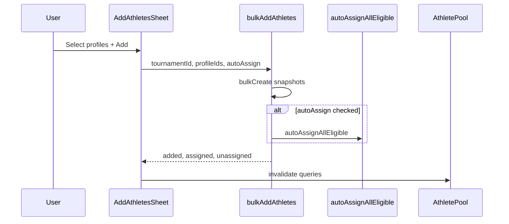

# Builder Add Athletes — Design Spec + Implementation Plan

> **For agentic workers:** REQUIRED SUB-SKILL: Use superpowers:subagent-driven-development (recommended) or superpowers:executing-plans to implement this plan task-by-task. Steps use checkbox (`- [ ]`) syntax for tracking.

**Goal:** Let tournament organizers add athletes from the org library directly in the builder Groups tab, without leaving to `/dashboard/athletes`.

**Architecture:** A right-side `AddAthletesSheet` browses paginated athlete profiles (server-filtered to exclude profiles already in the tournament), supports multi-select + lightweight filters, and calls `bulkAddAthletes`. Default lands athletes in the unassigned pool; optional `autoAssign` runs tournament-wide auto-assign after add. Backend gains `excludeTournamentId` on profile list, **implements the dormant `autoAssign` flag**, extracts **`GroupDAL.autoAssignAllEligible`** as the single orchestration module, exposes it via **`group.autoAssignAll`**, and refactors **`AutoAssignAllDialog`** to use that endpoint instead of a client-side loop.

**Commit policy:** **One git commit per task/todo.** Each task ends with an explicit `git add` + `git commit`. Do not batch tasks into a single commit.

**Tech Stack:** TanStack Router + Query, nuqs URL state, shadcn Sheet/Checkbox/Button, oRPC + Prisma, Vitest, Bun.

**Deliverables (two files written on execution):**

- Design spec: [`docs/specs/2026-05-22-builder-add-athletes-design.md`](docs/specs/2026-05-22-builder-add-athletes-design.md)
- This plan: [`docs/superpowers/plans/2026-05-22-builder-add-athletes.md`](docs/superpowers/plans/2026-05-22-builder-add-athletes.md)

---

## Architecture audit + deepening opportunities (in scope)

| #   | Opportunity                                  | Problem                                                                                                | Solution                                                                                          | Tasks |
| --- | -------------------------------------------- | ------------------------------------------------------------------------------------------------------ | ------------------------------------------------------------------------------------------------- | ----- |
| 1   | **Deepen `bulkAdd` + extract orchestration** | `autoAssign` on DTO is a stub; tournament-wide assign logic only lives in client loop                  | `GroupDAL.autoAssignAllEligible` + wire in `bulkAddAthletes` when flag true                       | 3, 4  |
| 2   | **Refactor `AutoAssignAllDialog`**           | Duplicated client loop over `group.autoAssign`                                                         | Call new `group.autoAssignAll` endpoint                                                           | 5     |
| 3   | **Fix misleading return counts + toasts**    | Handler always returns `assigned: 0`; `bulkAddAthleteResult` toast copy wrong when auto-assign checked | Count assigned among newly added profile IDs after auto-assign; add unit tests for toast branches | 4     |

### Architecture audit (auto-assign)

**Finding:** There is no combined "add + auto-assign" endpoint today.

| Module                      | Interface                     | Implementation status                                     |
| --------------------------- | ----------------------------- | --------------------------------------------------------- |
| `tournamentAthlete.bulkAdd` | Accepts `autoAssign: boolean` | **Stub** — always `{ assigned: 0, unassigned: added }`    |
| `group.autoAssign`          | Per-**Group** assign          | **Works** — `GroupDAL.autoAssign`                         |
| `AutoAssignAllDialog`       | UI only                       | Client loop — **to be replaced** by `group.autoAssignAll` |

---

## Design Spec Summary

### Problem

Setup checklist "Add athletes" deep-links to builder Groups tab, but the unassigned pool only shows athletes **already in the tournament**. The only add path today is the global Athletes page + `BulkAddAthletesDialog` (requires picking a tournament).

### Decisions (approved)

| Decision         | Choice                             |
| ---------------- | ---------------------------------- |
| Primary source   | Org athlete library (profiles)     |
| Post-add default | Unassigned pool                    |
| Auto-assign      | Checkbox, **unchecked by default** |
| UI shell         | Right-side Sheet                   |

### Entry points

1. Pool header — "Add athletes" button
2. Empty pool state — "Add from library" CTA
3. Setup checklist — `?tab=groups&addAthletes=1`

### Out of scope (v1)

Inline create, CSV import, full DataTable advanced filters.

### Data flow



---

## File Map

| File                                                                                                                                                                                 | Responsibility                   |
| ------------------------------------------------------------------------------------------------------------------------------------------------------------------------------------ | -------------------------------- |
| [`src/orpc/athlete-profiles/dto.ts`](src/orpc/athlete-profiles/dto.ts)                                                                                                               | `excludeTournamentId`            |
| [`src/orpc/athlete-profiles/dal.ts`](src/orpc/athlete-profiles/dal.ts)                                                                                                               | Tournament exclusion filter      |
| [`src/orpc/groups/dal.ts`](src/orpc/groups/dal.ts)                                                                                                                                   | `autoAssignAllEligible()`        |
| [`src/orpc/groups/index.ts`](src/orpc/groups/index.ts)                                                                                                                               | `autoAssignAll` procedure        |
| [`src/orpc/groups/dto.ts`](src/orpc/groups/dto.ts)                                                                                                                                   | `AutoAssignAllSchema`            |
| [`src/orpc/router.ts`](src/orpc/router.ts)                                                                                                                                           | Register `group.autoAssignAll`   |
| [`src/queries/groups.ts`](src/queries/groups.ts)                                                                                                                                     | `useAutoAssignAll` mutation hook |
| [`src/orpc/tournament-athletes/index.ts`](src/orpc/tournament-athletes/index.ts)                                                                                                     | Wire `autoAssign` in `bulkAdd`   |
| [`src/features/dashboard/athlete/lib/bulk-add-athletes.ts`](src/features/dashboard/athlete/lib/bulk-add-athletes.ts)                                                                 | Toast helper + tests             |
| [`src/features/dashboard/tournament/builder/components/dialogs/auto-assign-all-dialog.tsx`](src/features/dashboard/tournament/builder/components/dialogs/auto-assign-all-dialog.tsx) | Use `group.autoAssignAll`        |
| [`src/features/dashboard/tournament/builder/components/dialogs/add-athletes-sheet.tsx`](src/features/dashboard/tournament/builder/components/dialogs/add-athletes-sheet.tsx)         | New sheet UI                     |
| [`src/queries/athlete-profiles.ts`](src/queries/athlete-profiles.ts)                                                                                                                 | `useAthleteProfilesInfinite`     |
| Groups tab + setup-checklist files                                                                                                                                                   | Entry points + deep link         |

---

## Task 1: Write design spec document

**Files:**

- Create: [`docs/specs/2026-05-22-builder-add-athletes-design.md`](docs/specs/2026-05-22-builder-add-athletes-design.md)

- [ ] **Step 1:** Copy Design Spec Summary + architecture section + edge cases into spec file. Set status `Approved for implementation`.

- [ ] **Step 2: Commit**

```bash
git add docs/specs/2026-05-22-builder-add-athletes-design.md
git commit -m "docs: add builder add-athletes design spec"
```

---

## Task 2: Exclude tournament profiles from athlete list (backend)

**Files:**

- Modify: [`src/orpc/athlete-profiles/dto.ts`](src/orpc/athlete-profiles/dto.ts)
- Modify: [`src/orpc/athlete-profiles/dal.ts`](src/orpc/athlete-profiles/dal.ts)
- Create: [`src/orpc/athlete-profiles/__tests__/athlete-profile-dal.findMany.test.ts`](src/orpc/athlete-profiles/__tests__/athlete-profile-dal.findMany.test.ts)

- [ ] **Step 1: Write failing test**

```typescript
import { beforeEach, describe, expect, it, vi } from 'vitest';
import { AthleteProfileDAL } from '../dal';
import { prisma } from '@/lib/db';

vi.mock('@/lib/db', () => ({
  prisma: {
    athleteProfile: { findMany: vi.fn(), count: vi.fn() },
  },
}));

describe('AthleteProfileDAL.findMany excludeTournamentId', () => {
  beforeEach(() => vi.clearAllMocks());

  it('excludes profiles already registered in the tournament', async () => {
    vi.mocked(prisma.athleteProfile.findMany).mockResolvedValue([]);
    vi.mocked(prisma.athleteProfile.count).mockResolvedValue(0);

    await AthleteProfileDAL.findMany({
      page: 1,
      perPage: 20,
      excludeTournamentId: 'tournament-1',
      filters: [],
      joinOperator: 'and',
      sorting: [],
    });

    expect(prisma.athleteProfile.findMany).toHaveBeenCalledWith(
      expect.objectContaining({
        where: expect.objectContaining({
          NOT: {
            tournamentAthletes: {
              some: { tournamentId: 'tournament-1' },
            },
          },
        }),
      })
    );
  });
});
```

- [ ] **Step 2: Run test — expect FAIL**

```bash
bun test src/orpc/athlete-profiles/__tests__/athlete-profile-dal.findMany.test.ts
```

- [ ] **Step 3: Add `excludeTournamentId: z.string().optional()` to `AthleteProfilesSchema`**

- [ ] **Step 4: Merge tournament exclusion into DAL `where` clause** (use `AND` wrapper only when exclusion is set)

- [ ] **Step 5: Run test — expect PASS**

```bash
bun test src/orpc/athlete-profiles/__tests__/athlete-profile-dal.findMany.test.ts
```

- [ ] **Step 6: Commit**

```bash
git add src/orpc/athlete-profiles/dto.ts src/orpc/athlete-profiles/dal.ts src/orpc/athlete-profiles/__tests__/athlete-profile-dal.findMany.test.ts
git commit -m "feat: exclude tournament athletes from profile list query"
```

---

## Task 3 (Opportunity 1): Extract `autoAssignAllEligible` + expose `group.autoAssignAll`

**Files:**

- Modify: [`src/orpc/groups/dal.ts`](src/orpc/groups/dal.ts)
- Modify: [`src/orpc/groups/dto.ts`](src/orpc/groups/dto.ts)
- Modify: [`src/orpc/groups/index.ts`](src/orpc/groups/index.ts)
- Modify: [`src/orpc/router.ts`](src/orpc/router.ts)
- Modify: [`src/queries/groups.ts`](src/queries/groups.ts)
- Modify: [`src/orpc/groups/__tests__/groups.dal.test.ts`](src/orpc/groups/__tests__/groups.dal.test.ts)

- [ ] **Step 1: Write failing test for `autoAssignAllEligible`**

```typescript
it('autoAssignAllEligible skips groups that already have matches', async () => {
  // mock findMany → [{ id: 'g1', _count: { matches: 0 } }, { id: 'g2', _count: { matches: 2 } }]
  // mock autoAssign for g1 → { assigned: 3 }
  // expect autoAssign called once for g1 only; returns { assigned: 3, groupsRun: 1, groupsSkipped: 1 }
});
```

- [ ] **Step 2: Implement `GroupDAL.autoAssignAllEligible`**

```typescript
static async autoAssignAllEligible(input: {
  tournamentId: string;
  adminId: string;
}) {
  const groups = await prisma.group.findMany({
    where: { tournamentId: input.tournamentId },
    include: { _count: { select: { matches: true } } },
  });

  let assigned = 0;
  let groupsRun = 0;
  let groupsSkipped = 0;

  for (const group of groups) {
    if (group._count.matches > 0) {
      groupsSkipped += 1;
      continue;
    }
    groupsRun += 1;
    const result = await GroupDAL.autoAssign({
      tournamentId: input.tournamentId,
      groupId: group.id,
      adminId: input.adminId,
    });
    assigned += result.assigned;
  }

  return { assigned, groupsRun, groupsSkipped };
}
```

- [ ] **Step 3: Add DTO + oRPC procedure**

In [`dto.ts`](src/orpc/groups/dto.ts):

```typescript
export const AutoAssignAllSchema = z.object({
  tournamentId: z.string(),
});
```

In [`groups/index.ts`](src/orpc/groups/index.ts):

```typescript
export const autoAssignAllGroups = authedProcedure
  .input(AutoAssignAllSchema)
  .handler(async ({ input, context }) => {
    return GroupDAL.autoAssignAllEligible({
      tournamentId: input.tournamentId,
      adminId: context.user.id,
    });
  });
```

Register in [`router.ts`](src/orpc/router.ts) as `group.autoAssignAll`.

- [ ] **Step 4: Add `useAutoAssignAll` hook** in [`queries/groups.ts`](src/queries/groups.ts) (invalidates tournament + group + tournamentAthlete queries on success).

- [ ] **Step 5: Run tests — expect PASS**

```bash
bun test src/orpc/groups/__tests__/groups.dal.test.ts
```

- [ ] **Step 6: Commit**

```bash
git add src/orpc/groups/dal.ts src/orpc/groups/dto.ts src/orpc/groups/index.ts src/orpc/router.ts src/queries/groups.ts src/orpc/groups/__tests__/groups.dal.test.ts
git commit -m "feat: add autoAssignAllEligible and group.autoAssignAll endpoint"
```

---

## Task 4 (Opportunities 1 + 3): Wire `autoAssign` on `bulkAdd` + accurate counts + toast tests

**Files:**

- Modify: [`src/orpc/tournament-athletes/index.ts`](src/orpc/tournament-athletes/index.ts)
- Create: [`src/orpc/tournament-athletes/__tests__/bulk-add-auto-assign.test.ts`](src/orpc/tournament-athletes/__tests__/bulk-add-auto-assign.test.ts)
- Create: [`src/features/dashboard/athlete/lib/__tests__/bulk-add-athletes.test.ts`](src/features/dashboard/athlete/lib/__tests__/bulk-add-athletes.test.ts)

- [ ] **Step 1: Write failing handler test**

Assert when `autoAssign: true`:

- `GroupDAL.autoAssignAllEligible` is called
- Return shape counts **newly added** profiles only:

```typescript
// After bulkCreate returns profiles [{ id: 'p1' }, { id: 'p2' }]
// Mock tournamentAthlete.findMany for those profileIds + tournamentId
// → one with groupId set, one null
// expect { added: 2, assigned: 1, unassigned: 1 }
```

Assert when `autoAssign: false`: `autoAssignAllEligible` not called; `{ added: N, assigned: 0, unassigned: N }`.

- [ ] **Step 2: Update `bulkAddAthletes` handler**

```typescript
export const bulkAddAthletes = authedProcedure
  .input(BulkAddAthletesSchema)
  .handler(async ({ input, context }) => {
    const { tournamentId, athleteProfileIds, autoAssign } = input;

    const profiles = await prisma.athleteProfile.findMany({
      where: { id: { in: athleteProfileIds } },
    });

    const createdProfiles = await TournamentAthleteDAL.bulkCreate(
      tournamentId,
      profiles
    );
    const added = createdProfiles.length;
    const createdProfileIds = createdProfiles.map((p) => p.id);

    let assigned = 0;
    if (autoAssign && added > 0) {
      await GroupDAL.autoAssignAllEligible({
        tournamentId,
        adminId: context.user.id,
      });
    }

    if (createdProfileIds.length > 0) {
      const rows = await prisma.tournamentAthlete.findMany({
        where: {
          tournamentId,
          athleteProfileId: { in: createdProfileIds },
        },
        select: { groupId: true },
      });
      assigned = rows.filter((r) => r.groupId != null).length;
    }

    return { added, assigned, unassigned: added - assigned };
  });
```

Import `GroupDAL` in handler file.

- [ ] **Step 3: Write toast helper tests (Opportunity 3)**

```typescript
import { describe, expect, it, vi } from 'vitest';
import { toast } from 'sonner';
import { bulkAddAthleteResult } from '../bulk-add-athletes';

vi.mock('sonner', () => ({ toast: { success: vi.fn(), info: vi.fn() } }));

describe('bulkAddAthleteResult', () => {
  it('shows info when added is 0', () => {
    bulkAddAthleteResult({ added: 0, assigned: 0, unassigned: 0 });
    expect(toast.info).toHaveBeenCalled();
  });

  it('shows pool-only message when all unassigned', () => {
    bulkAddAthleteResult({ added: 3, assigned: 0, unassigned: 3 });
    expect(toast.success).toHaveBeenCalledWith(
      expect.stringContaining('unassigned pool')
    );
  });

  it('shows split message when some assigned', () => {
    bulkAddAthleteResult({ added: 3, assigned: 2, unassigned: 1 });
    expect(toast.success).toHaveBeenCalledWith(
      expect.stringMatching(/2 assigned.*1 unassigned/)
    );
  });
});
```

- [ ] **Step 4: Run tests — expect PASS**

```bash
bun test src/orpc/tournament-athletes/__tests__/bulk-add-auto-assign.test.ts src/features/dashboard/athlete/lib/__tests__/bulk-add-athletes.test.ts
```

- [ ] **Step 5: Commit**

```bash
git add src/orpc/tournament-athletes/index.ts src/orpc/tournament-athletes/__tests__/bulk-add-auto-assign.test.ts src/features/dashboard/athlete/lib/__tests__/bulk-add-athletes.test.ts
git commit -m "feat: wire autoAssign on bulkAdd with accurate result counts"
```

---

## Task 5 (Opportunity 2): Refactor `AutoAssignAllDialog` to use `group.autoAssignAll`

**Files:**

- Modify: [`src/features/dashboard/tournament/builder/components/dialogs/auto-assign-all-dialog.tsx`](src/features/dashboard/tournament/builder/components/dialogs/auto-assign-all-dialog.tsx)

- [ ] **Step 1: Replace client loop with single mutation**

Remove:

```typescript
for (const group of eligible) {
  const result = await client.group.autoAssign({
    groupId: group.id,
    tournamentId,
  });
  assignedSum += result.assigned;
}
```

Replace with `useAutoAssignAll()`:

```typescript
const autoAssignAll = useAutoAssignAll();

const handleRun = () => {
  autoAssignAll.mutate(
    { tournamentId },
    {
      onSuccess: (result) => {
        toast.success(
          `Auto-assigned ${result.assigned} athletes across ${result.groupsRun} groups (skipped ${result.groupsSkipped})`
        );
        onOpenChange(false);
      },
    }
  );
};
```

Keep existing eligible/skipped preview UI (still derived from `groups` prop locally for display only).

- [ ] **Step 2: Manual check** — Auto Assign All from builder bottom toolbar still works; toast shows correct counts.

- [ ] **Step 3: Commit**

```bash
git add src/features/dashboard/tournament/builder/components/dialogs/auto-assign-all-dialog.tsx
git commit -m "refactor: AutoAssignAllDialog uses group.autoAssignAll endpoint"
```

---

## Task 6: Add `useAthleteProfilesInfinite` query hook

**Files:**

- Modify: [`src/queries/athlete-profiles.ts`](src/queries/athlete-profiles.ts)

- [ ] **Step 1: Add infinite query** (mirror `useTournamentAthletesInfinite`):

```typescript
export function useAthleteProfilesInfinite(
  input: Omit<AthleteProfilesDTO, 'page'>
) {
  return useInfiniteQuery({
    queryKey: ['athleteProfile', 'list', 'infinite', input] as const,
    queryFn: ({ pageParam }: { pageParam: number }) =>
      client.athleteProfile.list({ ...input, page: pageParam }),
    initialPageParam: 1,
    getNextPageParam: (last, allPages) => {
      const fetched = allPages.reduce((acc, p) => acc + p.items.length, 0);
      return fetched < last.total ? allPages.length + 1 : undefined;
    },
    placeholderData: keepPreviousData,
  });
}
```

- [ ] **Step 2: Commit**

```bash
git add src/queries/athlete-profiles.ts
git commit -m "feat: add useAthleteProfilesInfinite hook"
```

---

## Task 7: Build `AddAthletesSheet` component

**Files:**

- Create: [`src/features/dashboard/tournament/builder/components/dialogs/add-athletes-sheet.tsx`](src/features/dashboard/tournament/builder/components/dialogs/add-athletes-sheet.tsx)

- [ ] **Step 1:** Sheet props: `open`, `onOpenChange`, `tournamentId`, `tournamentName`, `readOnly`

- [ ] **Step 2:** List + multi-select + filters + infinite scroll (`excludeTournamentId: tournamentId`)

- [ ] **Step 3:** Footer: auto-assign checkbox (default false), `useBulkAddAthletes` + `bulkAddAthleteResult`

- [ ] **Step 4:** Empty states (empty org / all already in tournament)

- [ ] **Step 5: Commit**

```bash
git add src/features/dashboard/tournament/builder/components/dialogs/add-athletes-sheet.tsx
git commit -m "feat: add AddAthletesSheet for builder library picker"
```

---

## Task 8: Wire entry points in Groups tab

**Files:**

- Modify: [`src/features/dashboard/tournament/builder/hooks/use-builder-manager-query.ts`](src/features/dashboard/tournament/builder/hooks/use-builder-manager-query.ts)
- Modify: [`src/features/dashboard/tournament/builder/components/groups-tab/index.tsx`](src/features/dashboard/tournament/builder/components/groups-tab/index.tsx)
- Modify: [`src/features/dashboard/tournament/builder/components/groups-tab/athlete-pool/index.tsx`](src/features/dashboard/tournament/builder/components/groups-tab/athlete-pool/index.tsx)

- [ ] **Step 1:** Add `addAthletes` nuqs param; consume on mount to open sheet

- [ ] **Step 2:** Pool header "Add athletes" button + empty state CTA

- [ ] **Step 3:** Render `<AddAthletesSheet />` in `GroupsTab`

- [ ] **Step 4: Commit**

```bash
git add src/features/dashboard/tournament/builder/hooks/use-builder-manager-query.ts src/features/dashboard/tournament/builder/components/groups-tab/index.tsx src/features/dashboard/tournament/builder/components/groups-tab/athlete-pool/index.tsx
git commit -m "feat: wire add-athletes sheet entry points in groups tab"
```

---

## Task 9: Setup checklist deep link

**Files:**

- Modify: [`src/features/dashboard/tournament/viewer/components/setup-checklist.tsx`](src/features/dashboard/tournament/viewer/components/setup-checklist.tsx)

- [ ] **Step 1:** For athletes step, add `addAthletes: true` to Link search

- [ ] **Step 2: Commit**

```bash
git add src/features/dashboard/tournament/viewer/components/setup-checklist.tsx
git commit -m "feat: deep-link setup checklist to add-athletes sheet"
```

---

## Task 10: Verification + save plan

- [ ] **Step 1: Run unit tests**

```bash
bun test src/orpc/athlete-profiles/__tests__/athlete-profile-dal.findMany.test.ts src/orpc/groups/__tests__/groups.dal.test.ts src/orpc/tournament-athletes/__tests__/ src/features/dashboard/athlete/lib/__tests__/bulk-add-athletes.test.ts
```

- [ ] **Step 2: Lint + build**

```bash
bun run lint
bun run build
```

- [ ] **Step 3: Manual smoke test** (builder sheet, auto-assign checkbox, global bulk-add dialog auto-assign, Auto Assign All toolbar action, setup checklist deep link, read-only)

- [ ] **Step 4: Save plan file + commit**

```bash
mkdir -p docs/superpowers/plans
cp .cursor/plans/builder_add_athletes_a548730d.plan.md docs/superpowers/plans/2026-05-22-builder-add-athletes.md
git add docs/superpowers/plans/2026-05-22-builder-add-athletes.md
git commit -m "docs: add builder add-athletes implementation plan"
```

---

## Spec Coverage Self-Review

| Requirement                           | Task      |
| ------------------------------------- | --------- |
| Library pick from builder             | 7, 8      |
| Unassigned pool default               | 4, 7      |
| Auto-assign checkbox off by default   | 7         |
| Exclude already-in-tournament         | 2         |
| Wire dormant bulkAdd autoAssign       | 4         |
| Extract autoAssignAllEligible (Opp 1) | 3         |
| Refactor AutoAssignAllDialog (Opp 2)  | 5         |
| Accurate counts + toast tests (Opp 3) | 4         |
| Pool header + empty state             | 8         |
| Setup checklist deep link             | 9         |
| One commit per todo                   | All tasks |

No placeholders remain.

---

**Plan complete.** Two execution options:

1. **Subagent-Driven (recommended)** — fresh subagent per task, review between tasks
2. **Inline Execution** — execute tasks in this session with checkpoints

Which approach?
